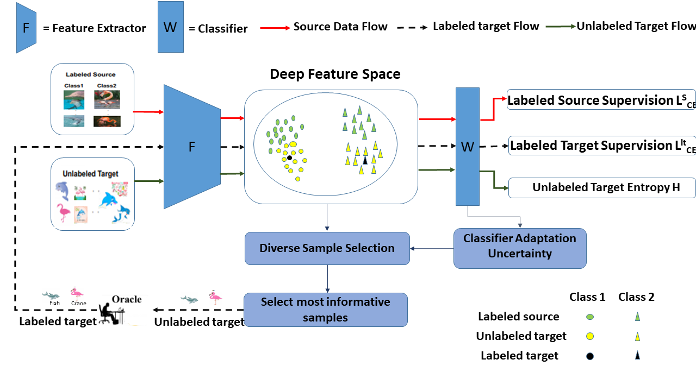

 # [Improving Semi Supervised Domain Adaptation using Target Selection and Semantics](https://openaccess.thecvf.com/content/CVPR2021W/LLID/html/Singh_Improving_Semi-Supervised_Domain_Adaptation_Using_Effective_Target_Selection_and_Semantics_CVPRW_2021_paper.html)

## Install

`conda env create -n SSDA.yml`

The code is written for Pytorch 0.4.0, but should work for other version
with some modifications.
## Data preparation (DomainNet)

Download the cleaned version of the domainnet data from [here](http://ai.bu.edu/M3SDA/) and place them inside the './data/multi/' folder.

The images will be stored in the following way.

`./data/multi/real/category_name`,

`./data/multi/sketch/category_name`

The dataset split files are stored as follows,

`./data/txt/multi/labeled_source_images_real.txt`,

`./data/txt/multi/unlabeled_target_images_sketch_3.txt`,

With regard to office and office home dataset, store the image files in the following ways,

 `./data/office/amazon/category_name`,
 `./data/office_home/Real/category_name`,

We provide the split of office and office-home.

## Training

To run training using alexnet,

`sh run_train.sh gpu_id method alexnet`

where, gpu_id = 0,1,2,3...., method=[MME,ENT,S+T].

### Reference
This implementation is based on the base MME implementation from [Kuniaki Saito](http://cs-people.bu.edu/keisaito/) and [Donghyun Kim](https://cs-people.bu.edu/donhk/)

